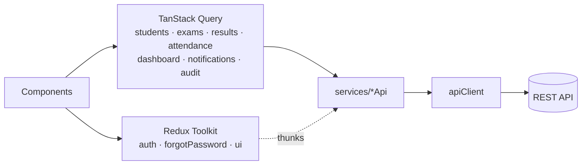

# College Portal — Web Client

React client for the College Portal: role-based dashboards, student management, exam scheduling, marks entry, a principal-approved result workflow, attendance and notifications.

**API, full architecture, security and engineering decisions:** see the [backend README](https://github.com/SATHIYAMOORTHY007/college-portal-backend#readme).

**Stack:** React 18 · Vite · Redux Toolkit · TanStack Query · React Router 6 · Axios · React Hook Form + Zod · Bootstrap 5 · Recharts · react-hot-toast · Vitest + Testing Library

---

## Quick start

```bash
npm install                 # .npmrc sets legacy-peer-deps (npm 10 resolver bug with optional peers)
cp .env.example .env        # VITE_API_BASE_URL=http://localhost:5000/api/v1
npm run dev                 # http://localhost:5173
```

The API must be running and seeded (`npm run seed` in the backend). In development the login page shows one-click demo accounts.

| Script | |
|---|---|
| `npm run dev` | Vite dev server |
| `npm run build` | Production build to `dist/` |
| `npm test` | Vitest (24 tests) |
| `npm run lint` | ESLint |

## Architecture

```
src/
├── app/               # App.jsx, providers (Redux / Query / Router), queryClient, setupApiAuth
├── store/             # Redux Toolkit: slices/, actions/ (createAsyncThunk), selectors/
├── services/          # apiClient.js (single Axios instance) + one API module per resource
├── components/ui/     # Button, Input, Select, Modal, ConfirmDialog, DataTable, Pagination,
│                      # SearchInput, KpiCard, StatusBadge, Loading/Empty/Error states
├── components/layout/ # Sidebar, Topbar, NotificationBell, UserMenu
├── features/          # auth · dashboard · students · users · departments · courses
│                      # exams · results · attendance · notifications · audit
├── layouts/           # AuthLayout, PortalLayout
├── routes/            # AppRoutes, ProtectedRoute, RoleRoute, GuestRoute
├── hooks/             # useDebounce, useListParams, usePermission, useClickOutside
├── constants/         # roles & permissions, routes, role-based navigation, semesters
├── styles/theme.css   # design tokens + components on top of Bootstrap 5
└── utils/             # formatting, error mapping, safe localStorage
```

Each feature folder owns its pages, modals, Zod schemas and TanStack Query hooks (`useStudents`, `useSaveStudent`…). Pages are lazy-loaded, so each role only downloads the screens it can open.

## State management: two tools, two jobs



| | Redux Toolkit | TanStack Query |
|---|---|---|
| Holds | Signed-in user, in-memory access token, auth status flags, sidebar state | Everything that comes from the API |
| Written by | `login` / `logout` / `refreshSession` thunks, `tokenRefreshed`, `sessionExpired` | Query hooks and mutations |
| Read with | Selectors (`selectCurrentUser`, `selectUserRole`, `selectHasPermission`) | `useStudents(params)` etc. |

Server data is **never** copied into Redux.

**Auth thunk lifecycle:** `dispatch(login(creds))` → `auth/login/pending` → `authApi.login` → `fulfilled` (session stored) or `rejected` (API message shown).

**Not stored:** the password, and the refresh token (an httpOnly cookie JavaScript can't read). The access token lives only in memory; on page load `refreshSession()` gets a new one from the cookie.

## API client and token refresh

[`services/apiClient.js`](src/services/apiClient.js) is the only place that talks HTTP:

- Base URL from `VITE_API_BASE_URL`, `withCredentials` for the refresh cookie, a 20 s timeout.
- Attaches `Authorization: Bearer <token>` from the store, which is injected at startup to avoid circular imports.
- Normalises every failure into an `ApiError { status, code, message, errors }`.
- **Single-flight refresh.** On a 401, every failing request awaits the same refresh promise (the queue), then retries once with the new token. If the refresh fails, all waiting requests are rejected, the session is cleared, and a toast explains why. Auth endpoints never trigger a refresh, and a request is never retried twice.

## UI system

- **Design tokens** (`theme.css`) on top of Bootstrap 5: an indigo SB-Admin-style sidebar, sticky blurred topbar, KPI cards, status badges, skeleton loaders and an accessible modal (portal, Escape, focus handling).
- **One `DataTable`** drives every list: column config, server-side sort headers, row selection for bulk actions, and built-in loading, empty and error states.
- **List state in the URL** (`useListParams`), so search, filters, sort and page survive reloads and can be shared. Search is debounced (400 ms).
- **Forms** use React Hook Form + Zod schemas that mirror the backend rules. Backend field errors are mapped back onto the inputs.
- **Toasts** are centralised: every failed mutation toasts the backend message through the `MutationCache`, and success toasts live in the mutation hooks.

## Role-based routing

| Role | Pages |
|---|---|
| Admin | Dashboard, Students, Staff, Departments, Courses & Subjects, Exams, Results, Notifications, Audit Logs |
| Principal | Dashboard, Students, Staff, Departments, Courses, Exams, **Result Approvals**, Notifications, Audit Logs |
| Examiner | Dashboard, Students, My Exams → **Marks grid**, Results, **Mark Attendance**, Notifications |
| Student | Dashboard, My Profile, My Exams, My Results, My Attendance, Notifications |

`ProtectedRoute` waits for session restore, then redirects signed-out users to login. `RoleRoute` shows an access-denied state for other roles. Buttons are hidden with `usePermission()`. **All of this is UX only; the API enforces every rule itself.**

## Testing

```bash
npm test
```

| File | Covers |
|---|---|
| `store/slices/authSlice.test.js` | login pending/fulfilled/rejected, password never stored, logout, failed session restore, token refresh, session expiry, selectors |
| `services/apiClient.test.js` | 3 concurrent 401s → **one** refresh and 3 retries; refresh failure rejects the queue and expires the session; no refresh loop; no refresh on failed login; network errors normalised |
| `routes/routeGuards.test.jsx` | waits for session restore, redirects signed-out users, role allow/deny |
| `features/results/ResultActions.test.jsx` | workflow buttons per status × permission (examiner submit, principal approve / send back / publish, student none) |
